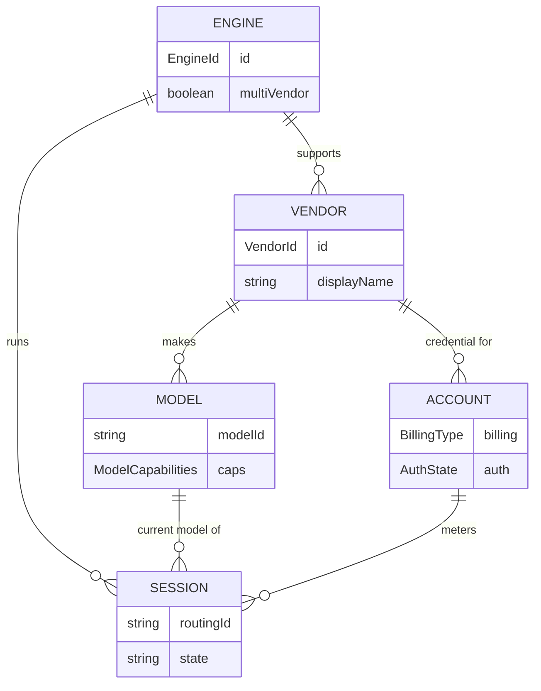

# Foundation 1 — Data Model

> **Status: DRAFT for discussion.** Defines the entities, identity, and relationships
> for the engine / vendor / account spine. Everything in foundations 2–6 references these
> types. See [README.md](README.md) for the overall frame.

## 1. Purpose & scope

This doc answers: *what are the core entities, how are they identified, and how do they
relate?* It deliberately **does not** define:

- the capability taxonomy (→ `02`) — only *where* capabilities attach,
- how settings are scoped/stored (→ `03`),
- login flows or multi-account switching (→ `04`) — only the account *descriptor*,
- metering math (→ `05`),
- engine runtime/lifecycle (process spawning, the shared opencode server) — that's an
  **engine-implementation** concern, not data-model. The data model is agnostic to *how* an
  engine runs.

## 2. Current state (Claude-fused)

The relevant types today (`src/shared/types.ts`):

```ts
type ProviderId = 'claude' | 'codex'            // actually means ENGINE

interface SessionCapabilities {                  // 10 booleans, frozen per provider
  thinkingModes, effortLevels, voice, hostedMcp, backgroundTasks,
  subagents, plan, costUsd, fork, sideQuestion
}
const CLAUDE_CAPABILITIES = Object.freeze({ ...all true })
const CODEX_CAPABILITIES  = Object.freeze({ ... })

interface SessionStatus {
  state, sessionId, model: string, cwd, totalCostUsd: number,
  provider: ProviderId, capabilities: SessionCapabilities
}

interface ModelInfo { value, displayName, description, supportsEffort?, supportedEffortLevels?, supportsAdaptiveThinking? }
interface CodexStatus { authenticated, email?, planLabel?, requiresLogin }   // codex-specific auth probe

// persisted: sessionProviders?: Record<sessionId, ProviderId>
```

**Problems for V2:**
1. `ProviderId` conflates engine and vendor (a `claude` session is *also* implicitly vendor
   `anthropic` and account `Anthropic subscription`).
2. Capabilities are a **frozen per-engine constant**. opencode proves capability varies
   **per-model and changes mid-session** (anthropic `thinking` vs openai `reasoningEffort`
   vs none).
3. `model: string` has no vendor qualification — `claude-opus-4-8` is ambiguous once an
   engine can run many vendors' models.
4. `totalCostUsd` assumes USD cost exists. Token-billed and free-local accounts don't fit.
5. `CodexStatus` is a one-off; there's no neutral account/auth descriptor.

## 3. The entities

### 3.1 Engine — the harness

```ts
type EngineId = 'claude' | 'opencode'   // 'codex' reserved (dormant fallback)

interface EngineDescriptor {
  id: EngineId
  displayName: string
  logo: string                    // asset key for sidebar/topbar badge
  multiVendor: boolean            // claude: false. opencode: true.
  capabilities: EngineCapabilities    // engine-level, vendor-independent — defined in 02
  // config plane, persistence model, slash/skill support → described in 02/03, not here
}
```

`EngineDescriptor` is a **static descriptor** (a small registry, one per engine). The
runtime connection (cli.js process / shared opencode server) is separate and lives in the
engine implementation.

### 3.2 Vendor — the model maker

```ts
type VendorId = 'anthropic' | 'openai' | 'google' | 'local' | (string & {})  // open-ended

interface VendorDescriptor {
  id: VendorId
  displayName: string
  logo: string
  // auth/billing characteristics surfaced for the account layer (04/05)
}
```

`VendorId` is **open-ended** (a known union widened with `string & {}`): opencode sources
vendors dynamically from models.dev/config, so we can't enumerate them statically. Known
vendors get constants + logos; unknown ones fall back to a generic badge.

- claude engine → exposes exactly `{ anthropic }` (hardcoded in its descriptor).
- opencode engine → exposes the set returned by `GET /config/providers`, filtered to
  authenticated vendors (see 04).

### 3.3 Model — always engine+vendor qualified

```ts
interface ModelRef {            // the identity / selection key used everywhere
  engineId: EngineId
  vendorId: VendorId
  modelId: string               // 'claude-opus-4-8', 'gpt-5-codex', 'gemma-3n-e4b'
}

interface ModelDescriptor extends ModelRef {
  displayName: string
  description?: string
  capabilities: ModelCapabilities   // reasoning/vision/context/tool-calling — defined in 02
}
```

`ModelRef` is the canonical key for the model picker, session status, and persistence.
Wire-format mapping is an engine concern: claude sends `modelId`; opencode sends
`{providerID: vendorId, modelID: modelId}` (or the `vendorId/modelId` string at config level).

> Reasoning presets: opencode's `variant` (named options preset) was considered as a 4th
> identity field and **dropped** — it overlaps with the effort/thinking control (02). We drive
> reasoning through that control, not through model identity.

### 3.4 Account — credential + metering identity for (engine × vendor)

```ts
type BillingType = 'subscription' | 'apiKey' | 'free' | 'unknown'
type AuthState   = 'authenticated' | 'unauthenticated' | 'unknown'

interface AccountRef {
  engineId: EngineId
  vendorId: VendorId
  billingType: BillingType        // drives metering (05): windowed vs token vs none
  authState: AuthState            // drives the auth card (04)
  label?: string                  // 'ChatGPT Plus', account email, etc.
  accountId?: string              // selectable identity for multi-account engines (Claude, ADR-015);
                                  // absent/implicit for delegated engines (opencode auth.json)
}
```

Account splits into two concerns, and only the first lives in the core data model:

- **Resolved `AccountRef`** (above) — the session-level descriptor of *which (engine, vendor)
  credential is active, whether it's usable, and how it's billed*. Always derived; held on the
  session. This is all foundations 4 (auth) and 5 (metering) need to hang off.
- **Account-info registry** — for engines with user-selectable multi-account (today **only
  Claude**, ADR-015), we track *metadata about* known accounts (label, email, billing type,
  which is active) in our persisted store, so we can list and **swap** accounts. **Credentials
  stay engine-owned and file-based** — ADR-015 for Claude, opencode's own `auth.json` per
  vendor — we do not move secrets into our store. opencode delegates auth entirely, so this
  registry is **Claude-only** in practice (opencode's account is implicit per vendor).

The registry schema + swap flow are foundation 4's job; here we commit only to the resolved
`AccountRef` on the session plus the existence of a Claude-side account-info registry. That
registry lives in the **operational DB** (account info is app-managed, not hand-edited) — see
[persistence.md](persistence.md); credentials stay file-based regardless.

### 3.5 Session — the runtime aggregate

```ts
interface SessionDescriptor {
  routingId: string
  sessionId: string | null            // engine-assigned, after first exchange
  engineId: EngineId
  model: ModelRef                     // CURRENT model — mutable mid-session on multiVendor engines
  account: AccountRef
  cwd: string
  capabilities: ResolvedCapabilities  // = resolve(engine.caps, model.caps) — see 02
  state: 'idle' | 'running' | 'error' | 'disconnected'
  metering: MeteringSnapshot          // replaces bare totalCostUsd — see 05
}
```

The Session is where the three layers come together. The key behavioral change: **`model`,
`account`, `capabilities`, and `metering` can all change mid-session** when the user switches
models on a multi-vendor engine — they are not fixed at creation as they are today.
**`engineId` is the exception — immutable per session** (fixed at creation, never swapped).
Model switches apply **in-place** to the live engine (no respawn), bounded by what the engine
offers: on single-vendor engines the switch stays within that vendor; on multi-vendor engines
it may cross vendors, re-resolving `account` + `capabilities` + `metering`.

## 4. Relationships



- **Engine → Vendor** is 1:1 for claude (`anthropic`), 1:N for opencode.
- **Model** is uniquely keyed by `(engineId, vendorId, modelId)`.
- **Account** is per `(engineId, vendorId)`; a session's `account` is resolved from its
  engine + current model's vendor.
- **Capabilities** are not their own entity — they attach to Engine and Model and are
  *resolved* onto the Session (see §6).

## 5. Identity & keys

| Concept | Key | Notes |
| --- | --- | --- |
| Engine | `EngineId` (closed union) | small static registry |
| Vendor | `VendorId` (open string) | known constants + dynamic from opencode |
| Model | `ModelRef` | the universal selection/persistence key |
| Account | `(engineId, vendorId)` + optional `accountId` | selectable only on multi-account engines |
| Session | `routingId` → rekeyed to engine `sessionId` | unchanged from today's rekey pattern |

## 6. Capability resolution (attachment points only — taxonomy in 02)

Effective session capabilities are a **function of engine and model**, computed (not a frozen
constant):

```ts
type ResolvedCapabilities = /* shape defined in 02 */
function resolveCapabilities(engine: EngineDescriptor, model: ModelDescriptor): ResolvedCapabilities
```

- **Engine-level** caps (vendor-independent): voice, hostedMcp, backgroundTasks, subagents,
  plan, fork, steer/queue…
- **Model-level** caps (vendor/model-specific): reasoning (thinking/effort), vision, context
  window, tool-calling…
- **Effective** = combine the two. Example: opencode (engine: hostedMcp ✓, fork ✓) running
  `anthropic/claude-opus` (model: thinking ✓) vs `openai/gpt-5` (model: effort tiers ✓).

This is what foundation 2 specifies. The data model's only commitment: capabilities resolve
**at session creation and on every model change**, and the renderer must react to capability
changes mid-session (today it sets them once).

## 7. Migration from current types

| Today | V2 | Migration |
| --- | --- | --- |
| `ProviderId = 'claude' \| 'codex'` | `EngineId = 'claude' \| 'opencode'` | rename; drop codex; add opencode |
| `SessionStatus.provider` | `.engineId` | rename |
| `SessionStatus.model: string` | `.model: ModelRef` | wrap; vendor=anthropic for claude |
| `SessionCapabilities` (frozen const) | `ResolvedCapabilities` (computed) | split engine/model caps, resolve fn (02) |
| `CLAUDE_/CODEX_CAPABILITIES` consts | `EngineDescriptor.capabilities` + `ModelCapabilities` | move into descriptors |
| `SessionStatus.totalCostUsd: number` | `.metering: MeteringSnapshot` | USD becomes optional, per billing type (05) |
| `ModelInfo` | `ModelDescriptor` | add `ModelRef` identity + structured caps |
| `CodexStatus` | `AccountRef` (+ probe in 04) | generalize the one-off |
| persisted `sessionProviders: Record<sid, ProviderId>` | per-session `{ engineId, model: ModelRef, account?: {vendorId, accountId?} }` | richer persisted metadata |

Back-compat: persisted sessions without engine metadata default to
`engineId: 'claude', vendorId: 'anthropic'`.

## 8. Naming: `provider` → `engine`

Recommend an **eager rename** of `ProviderId`→`EngineId` and `provider`→`engine`/`engineId`
across main + renderer + shared, rather than aliasing. Rationale:

- "provider" is now genuinely ambiguous (engine? vendor?), and **opencode's own API uses
  "provider" to mean vendor** — keeping our meaning guarantees permanent confusion when
  reading opencode responses/code.
- The rename is mechanical (type-driven) and one-time; aliasing leaves the ambiguity forever.

Cost: a wide but shallow diff touching IPC field names, store keys, persisted-config keys
(needs a read-time migration for `sessionProviders`), and the remote protocol. Acceptable
for a V2.

## 9. Resolved decisions

All foundation-1 open questions are now decided:

1. **Eager rename** ✓ — `ProviderId`→`EngineId`, `provider`→`engine`/`engineId` across
   main/renderer/shared/remote, with a read-time migration for persisted keys (§8).
2. **Account** ✓ — the session holds the derived `AccountRef`; account *info* lives in the
   operational DB (Claude-only in practice); **credentials stay file-based** (ADR-015); account
   *switching* is engine-local, surfaced in 04 (§3.4).
3. **Mid-session switching** ✓ — **`engineId` is immutable per session**; the **model is
   switchable in-place** on the live engine (no respawn), bounded by what the engine offers
   (claude → anthropic models; opencode → any configured vendor's models). Cross-vendor switches
   re-resolve account + capabilities + metering. *(Pending your confirm: we never swap the
   engine itself mid-session, only the model.)*
4. **`variant`** ✓ — dropped; reasoning is driven by the effort/thinking control (02).
5. **Unknown vendors** ✓ — curate logos for known vendors; for a genuinely anonymous model,
   show the **model name + a generic "unknown" icon** (don't fabricate a vendor identity).
6. **Persistence** ✓ — **split**: human-editable **config stays in plain-text files** (settings,
   permission rules, MCP config, slash commands — editable without the app running; cli.js-
   consumed config must be files anyway, ADR-009); **operational/derived data → a DB** (usage,
   account info, engine/model capability cache, session metadata); **credentials stay file-based**
   (ADR-015). Detailed in [persistence.md](persistence.md) (incl. the open DB-library choice).
